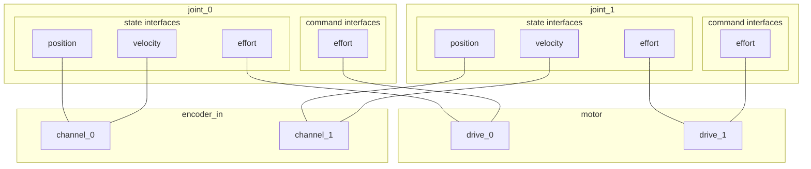

# ROS2 control - SOEM EtherCAT driver
## hardware configuration
### load plugin and configure network device to use
> ℹ use `xacro` macros to make network interface configurable
```xml
  <ros2_control name="GenericSystem" type="system">
    <hardware>
      <plugin>soem_driver/SOEMDriver</plugin>
      <ec_interface>eth1</ec_interface>
    </hardware>
  </ros2_control>
```

### configure slaves to use
configure all slaves on the bus, to be used for command or state interfaces of your robot. slaves may export multiple logical functions or functional units, that may each provide only a limited subset of the required functionality of a complete joint, or make one slave serve multiple joints. slaves export these as named *claims* and joints consume a number of these claims, by name of the slave and claim.
* name the slave
* provide alias and position on bus
* specifiy which plugin module implements the interface for this slave
* supply additional, slave specific configuration parameters as: `<param name="{parameter name}">{parameter value}</param>`

```xml
  <ros2_control name="GenericSystem" type="system">
    <hardware>
      <plugin>soem_driver/SOEMDriver</plugin>
      <ec_interface>eth1</ec_interface>
      
      <!-- slave configuration -->
      
      <ec_slave name="controller_0">
          <alias>0</alias>
          <position>0</position>
          <plugin>soem_slave_modules/soem_mock_module</plugin>
      </ec_slave>

      <ec_slave name="controller_1">
          <alias>0</alias>
          <position>1</position>
          <plugin>soem_slave_modules/soem_mock_module</plugin>
          <param name="someparam">some value</param>
      </ec_slave>
      
      <!-- slave configuration end -->
    
    </hardware>
  </ros2_control>
```

### configure joint claims
configure function claims of a joint by specifying the slaves' and claims' name, separated by a `/`; e.g. `controller_0/drive_0`. Provide the claims as a *YAML* sequence (list) of strings. For a single claim you may use a string without embedding into a sequence. command and state interface mapping between joints and slave claims is performed automatically. to use only a specific command or state interface of a claim, specify it as `<slave>/<claim>/[state|command]/<interface_name>`. See next section for mor info.
```xml
  <ros2_control name="GenericSystem" type="system">

    <joint name="joint_0">
        <command_interface name="position"/>

        <!-- claims configuration -->
        <param name="ec_claims">controller_0/drive_0</param>
        <!-- claims configuration end -->
    </joint>

    <joint name="joint_1">
        <state_interface name="position"/>
        <state_interface name="velocity"/>
        <command_interface name="position"/>

        <!-- claims configuration -->
        <param name="ec_claims">
          [
            controller_0/drive_1,
            controller_0/feedback_1
          ]
        </param>
        <!-- claims configuration end -->
    </joint>

    <joint name="joint_2">
        <state_interface name="position"/>
        <state_interface name="velocity"/>
        <state_interface name="effort"/>
        <command_interface name="position"/>

        <!-- claims configuration -->
        <param name="ec_claims">
            - controller_1/drive_0
            - controller_1/feedback_0
            - sensor_2/torque/state/effort
        </param>
        <!-- claims configuration end -->
    </joint>

  </ros2_control>
```

## mapping claims to joint interfaces
### what is a claim? and why?
Plugins for EtherCAT slaves export state and command interfaces to the driver, just like a joint does to the controller-/resource-manager. A claim shall be a named (sub-) set of state and command interfaces offered by a slave, used to reduce complexity when specifying a joints hardware interface. Joints may as well claim individual interfaces of a slaves claims though.

EtherCAT slaves providing the functions to build a robot do not necessarily implement a complete drive controller with all necessary interfaces, or slaves may implement multiple channels of their function (e.g. multiple encoder inputs on one slave). To account for these kind of setups, and allow for the necessary command and state interfaces for a joint to be provided by different EtherCAT slaves, or a slave to provide multiple joints with their hardware interfaces, we allow each *slave to provide* and each *joint to consume* multiple claims.

#### example use case
Assume presence of two slaves:
* Slave 1 `encoder_in`:
    * Dual Encoder Interface
    * claims: `channel_0`, `channel_1`
* Slave 2 `motor`:
    * Dual DC Motor driver (i.e. H-bridge; without feedback)
    * claims: `drive_0`, `drive_1`

These two slaves may be used to provide two joints with their command and state interfaces, with each joint claiming one `motor/drive_<N>` and one `encoder_in/channel_<N>` claim.



### consuming claims & command/state interfaces
> ⚠ The driver **does not**:
> * count for overallocation of claims and/or their individual interfaces by multiple joints
> * check if all command or state interfaces of the robot are satisfied by the configured claims; this is left to the resource manager

Claims may be consumed by joints in three ways:
* the whole claim, as `<slave>/<claim>`, using all command and state interface of that claim
* only the state or command interfaces, as `<slave>/<claim>/[state|command]`
* a specific command or state interface of a claim `<slave>/<claim>/[state|command]/<interface_name>`


Only command and state interfaces configured for a joint (in URDF) will be exported to the resource manager. Thus, if multiple claims requested by a joint provide a (e.g. `position` state-) interface, the first one, in order as specified, will be used.

### command mode switches: mapping to slaves
TODO: implement interface and "resolver"


## implementing a slave driver module
Derive from `soem_driver_slave_interface::SOEMDriverSlave`.

Sequence of method calls throughout lifecycle, aligned to the lifecycle of the SOEM driver hardware interface; see [1,2]. *State and command interfaces have to be exported prior to initialization and knowledge of actual revision number of the slave, as bus access is only allowed in `on_configure()` hook of the SOEM driver.*
* default constructor
* `init( parameters )`: setup data structures if necessary; gets passed slave parameters from URDF
* `export_state_interfaces()`: export state interface, prefixed by claim names
* `export_command_interfaces()`: export command interface, prefixed by claim names
* `configure( vendor_id, product_code, revision_number, parameters )`: configure driver for operation
* `setup_SDO_hook( SDOwrite )`: will be called from SOEM when setting up the device; allows PDO configuration by writing SDOs. do not use when your device does not require special PDO setup

No bus access and communication is possible when configuring (`configure()` call). Performing advanced initialization procedures has to be handled by implementing the necessary logic and state machines in the cyclic calls to `read()` and `write()`.

When initialized and while operating, the `read()` and `write()` methods will be called continuously. Use them to map and transform the data between `RxPDO` & `TxPDO` members and the exported state and command interfaces. When necessary, you may send mailbox messages to your slave by calling `schedule_Mbx_send(msg, callback)`, if callback is given, we expect the slave to respond with a mailbox message itself and call the callback function upon reception.

## internals
### call sequence
* driver: `on_init()`
  * load slave modules
  * slave modules: `init()`
* driver: `on_configure()`
  * master: `init()`
  * slave modules: `configure()`
  * master: `start_bus()` (SAFE OP)
* driver: `on_activate()`
  * master: `run()`
* <loop>
* driver: `on_deactivate()`
  * master: `stop()`

### buffer type
simple `std::span<std::byte>`, deeper dive in [3]

## TODO
* what to do with bit oriented slaves?

## References
* [0] https://github.com/OpenEtherCATsociety/SOEM
* [1] https://raw.githubusercontent.com/ros-controls/control.ros.org/master/doc/resources/presentations/2022-06_ROSConFr_What-is-new-in-ros2_control.pdf
* [2] https://github.com/ros-controls/ros2_control/issues/551#issuecomment-947174795
* [3] https://vector-of-bool.github.io/2020/08/29/buffers-1.html
* [4] https://bootlin.com/doc/training/preempt-rt/preempt-rt-slides.pdf
* [5] https://github.com/ICube-Robotics/ethercat_driver_ros2
* [6] https://github.com/orocos/rtt_soem
* [7] https://github.com/leggedrobotics/soem_interface
* [8] https://roscon.ros.org/2015/presentations/RealtimeROS2.pdf
* [9] https://github.com/OpenEtherCATsociety/SOEM/issues/696#issuecomment-1514232519